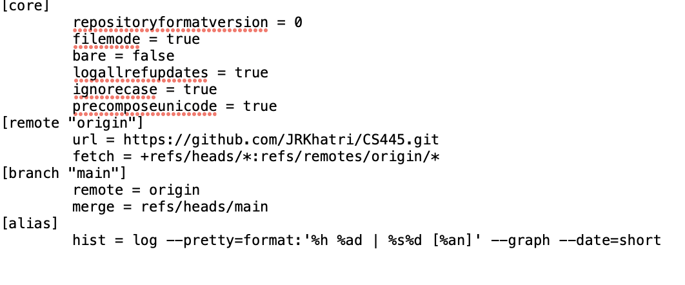

# This is lab1 solutions
* Exercise 1
#_Steps to initialize the github and local repository_
*Steps*
1. Open repository in Github with readme 
2. Copy the url of repository 
3. Make a local repository in your pc by -git clone (paste url of Github repository)
4. Create folder inside repository folder(where different day assignment folder can be made)(create .md file in different day lab folder where we can put link of screenshot or paste code or write text etc)
5. In README.md file which is on repository folder make the link of different day lab folder and file
6. Then do git add , git commit and git push origin main
7. Work with different day lab folder (e.g in .md file put the link of photo which is inside same folder )


8. Then git add, git commit, git push origin main of the specific folder 

#_Code used to initilized the repository mention above step_

```
jrkhatri@Jyotis-MacBook-Pro Assignment % git clone https://github.com/JRKhatri/CS445-lab.git
Cloning into 'CS445-lab'...
remote: Enumerating objects: 3, done.
remote: Counting objects: 100% (3/3), done.
remote: Total 3 (delta 0), reused 0 (delta 0), pack-reused 0
Receiving objects: 100% (3/3), done.
jrkhatri@Jyotis-MacBook-Pro Assignment % cd CS445-lab 
jrkhatri@Jyotis-MacBook-Pro CS445-lab % git status
On branch main
Your branch is up to date with 'origin/main'.

Changes not staged for commit:
  (use "git add <file>..." to update what will be committed)
  (use "git restore <file>..." to discard changes in working directory)
        modified:   README.md

Untracked files:
  (use "git add <file>..." to include in what will be committed)
        lab1/

no changes added to commit (use "git add" and/or "git commit -a")
jrkhatri@Jyotis-MacBook-Pro CS445-lab % git add README.md
jrkhatri@Jyotis-MacBook-Pro CS445-lab % git commit README.md -m "initialization commit of Readme.md"
[main 9c7703d] initialization commit of Readme.md
 1 file changed, 5 insertions(+), 1 deletion(-)
jrkhatri@Jyotis-MacBook-Pro CS445-lab % git push origin main
Enumerating objects: 5, done.
Counting objects: 100% (5/5), done.
Delta compression using up to 8 threads
Compressing objects: 100% (2/2), done.
Writing objects: 100% (3/3), 379 bytes | 379.00 KiB/s, done.
Total 3 (delta 0), reused 0 (delta 0), pack-reused 0
To https://github.com/JRKhatri/CS445-lab.git
   8158746..9c7703d  main -> main
jrkhatri@Jyotis-MacBook-Pro CS445-lab % git status
On branch main
Your branch is up to date with 'origin/main'.

Untracked files:
  (use "git add <file>..." to include in what will be committed)
        lab1/

nothing added to commit but untracked files present (use "git add" to track)
jrkhatri@Jyotis-MacBook-Pro CS445-lab % cd lab1
jrkhatri@Jyotis-MacBook-Pro lab1 % git status
On branch main
Your branch is up to date with 'origin/main'.

Untracked files:
  (use "git add <file>..." to include in what will be committed)
        ./

nothing added to commit but untracked files present (use "git add" to track)
jrkhatri@Jyotis-MacBook-Pro lab1 % cd .           
jrkhatri@Jyotis-MacBook-Pro lab1 % cd..
zsh: command not found: cd..
jrkhatri@Jyotis-MacBook-Pro lab1 % cd CS445-lab
cd: no such file or directory: CS445-lab
jrkhatri@Jyotis-MacBook-Pro lab1 % cd .CS445-lab
cd: no such file or directory: .CS445-lab
jrkhatri@Jyotis-MacBook-Pro lab1 % cd ..
jrkhatri@Jyotis-MacBook-Pro CS445-lab % git status
On branch main
Your branch is up to date with 'origin/main'.

Untracked files:
  (use "git add <file>..." to include in what will be committed)
        lab1/

nothing added to commit but untracked files present (use "git add" to track)
jrkhatri@Jyotis-MacBook-Pro CS445-lab % git add .
jrkhatri@Jyotis-MacBook-Pro CS445-lab % git commit -m "commit of lab folder and file"
[main 58c12c4] commit of lab folder and file
 1 file changed, 1 insertion(+)
 create mode 100644 lab1/lab1.md
jrkhatri@Jyotis-MacBook-Pro CS445-lab % git push origin main
Enumerating objects: 5, done.
Counting objects: 100% (5/5), done.
Delta compression using up to 8 threads
Compressing objects: 100% (2/2), done.
Writing objects: 100% (4/4), 368 bytes | 368.00 KiB/s, done.
Total 4 (delta 0), reused 0 (delta 0), pack-reused 0
To https://github.com/JRKhatri/CS445-lab.git
   9c7703d..58c12c4  main -> main
jrkhatri@Jyotis-MacBook-Pro CS445-lab % 

```

